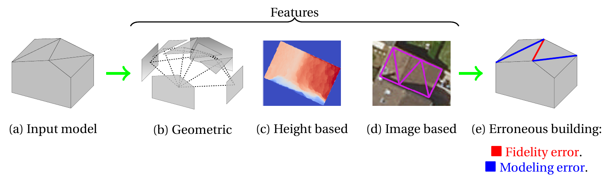

# The necessary yet complex evaluation of 3D city models: a semantic approach

The automatic modeling of urban scenes in 3D from geospatial data has been studied for more than thirty years. However, the output models still have to undergo a tedious task of correction at city scale. In this work, we propose an approach for automatically evaluating the quality of 3D building models. A taxonomy of potential errors is first proposed. Handcrafted features are computed, based on the geometric properties of buildings and, when available, Very High Resolution images and depth data. They are fed into a Random Forest classifier for the prediction of the quality of the models. We tested our framework on three distinct urban areas in France. We can satisfactorily detect, on average 96% of the most frequent errors.

